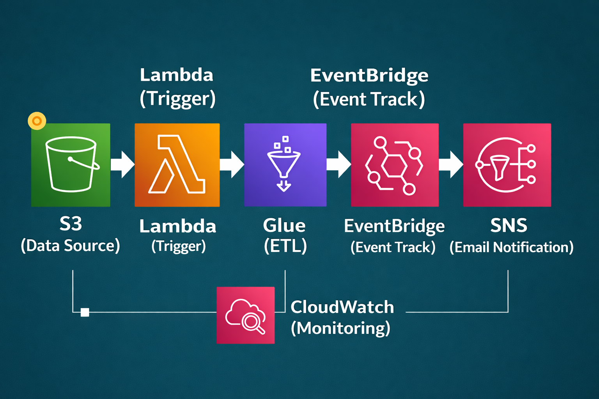
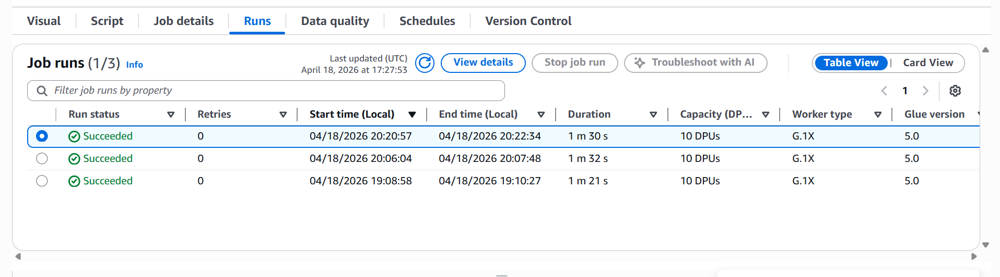
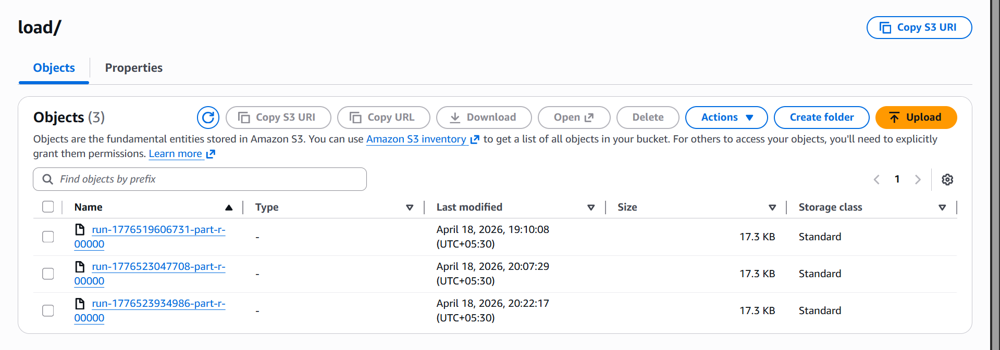

# AWS Serverless Data Pipeline (CSV ETL) 

An event-driven AWS data pipeline that ingests CSV files from Amazon S3, triggers AWS Lambda, performs ETL in AWS Glue (including duplicate removal), and provides visibility through EventBridge, SNS, and CloudWatch.

Manual CSV processing is repetitive and error-prone. This project automates ingestion, transformation, deduplication, and output publishing in a scalable serverless workflow.

## Architecture Overview 🧭

Pipeline flow:
1. **S3 (Data Source)** receives raw CSV files.
2. **Lambda (Trigger)** starts the Glue job on new file upload.
3. **Glue (ETL)** cleans data and removes duplicates.
4. **EventBridge (Event Track)** captures pipeline events.
5. **SNS (Email Notification)** sends status notifications.
6. **CloudWatch (Monitoring)** tracks logs and operational health.

Architecture diagram:



## Tech Stack 🛠️

- **Amazon S3** for raw and curated data storage
- **AWS Lambda** for event-driven orchestration
- **AWS Glue** for ETL and deduplication
- **Amazon EventBridge** for event tracking
- **Amazon SNS** for email notifications
- **Amazon CloudWatch** for logs and monitoring

## ETL Logic ✅

Current ETL behavior:
- Reads CSV files from raw S3 path
- Removes duplicate records
- Writes cleaned output to curated S3 path
- Runs basic data quality checks in Glue

Config placeholders are intentionally used in code for safe public sharing.

## Real Execution Evidence 📊

From actual Glue runs:
- **Success rate:** 3/3 runs succeeded
- **Durations:** 1m 30s, 1m 32s, 1m 21s
- **Retries:** 0
- **Compute:** 10 DPUs, G.1X workers
- **Glue version:** 5.0

From curated S3 output:
- Output generated under **load/** prefix
- 3 output files produced
- Each file size is approximately **17.3 KB**

## Proof Screenshots 🖼️

Glue job run success:



S3 curated output:



## Project Structure 📁

```text
.
|-- architecture/
|   |-- pipeline-architecture.png
|-- lambda/
|   |-- lambda_handler.py
|-- glue/
|   |-- glue_etl_job.py
|-- sample-data/
|   |-- input.csv
|   |-- output_cleaned.csv
|-- screenshots/
|   |-- glue-job.png
|   |-- s3-load.png
|-- .gitignore
|-- README.md
```
